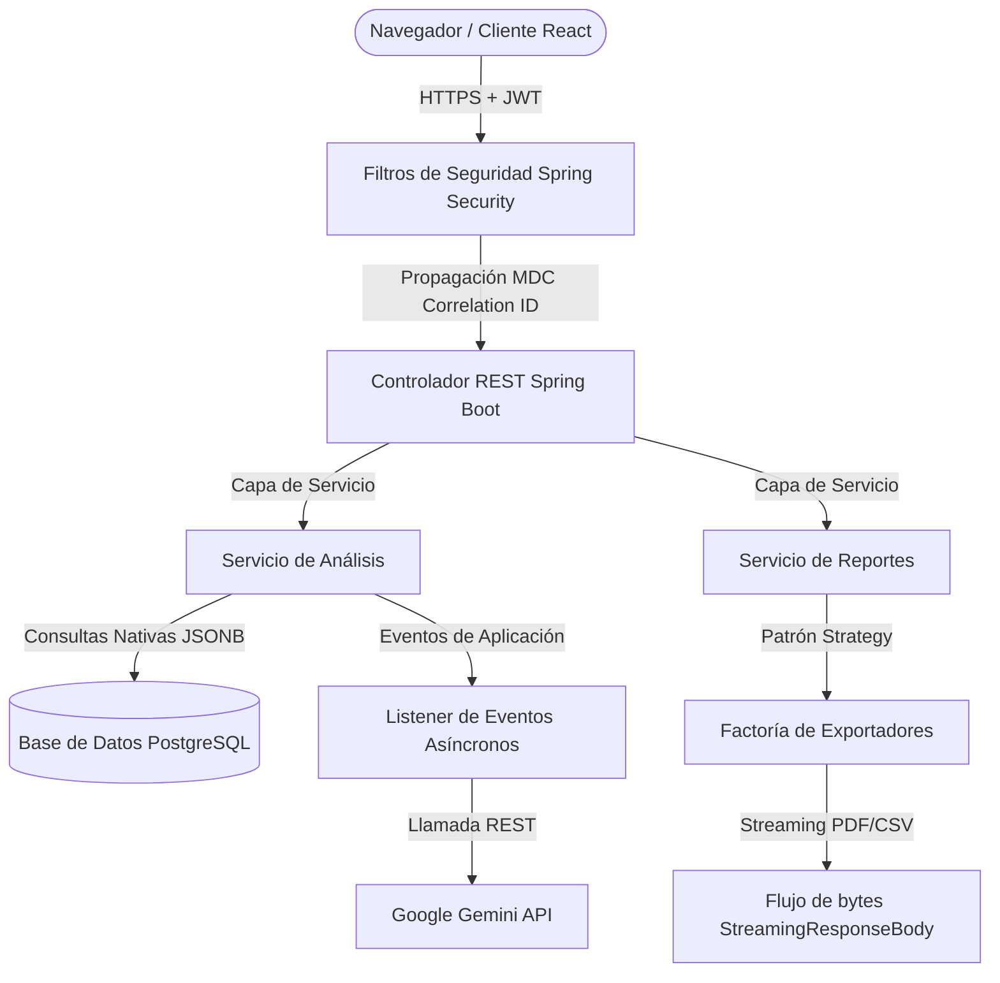

# OpinAI - Plataforma SaaS de Analíticas de Feedback con Inteligencia Artificial

<!-- Badges -->
[](https://github.com/<username>/<repo-name>/actions/workflows/backend.yml)


OpinAI es una plataforma SaaS multi-inquilino diseñada para procesar, clasificar y extraer resúmenes analíticos y oportunidades de acción del feedback de clientes utilizando Inteligencia Artificial generativa.

---

## Por qué construí OpinAI

OpinAI se desarrolló como un proyecto de portafolio profesional para simular una aplicación SaaS real lista para producción. En lugar de centrarse únicamente en operaciones CRUD básicas, el proyecto se diseñó para demostrar prácticas de desarrollo senior, enfocándose en:

*   **Aislamiento multi-inquilino seguro**: Garantizar la contención de datos con confianza cero entre diferentes usuarios registrados.
*   **Resiliencia asíncrona**: Manejar el procesamiento pesado de APIs externas de forma limpia sin agotar los recursos del servidor.
*   **Optimización del rendimiento**: Diseñar capas de datos optimizadas aprovechando operaciones a nivel de base de datos en lugar de procesamiento pesado en la JVM.
*   **Código limpio y mantenible**: Organizar componentes mediante patrones desacoplados (Strategy, Factory) y una separación clara de los límites transaccionales.

---

## Estadísticas del Proyecto

*   **Backend**: Java 21 + Spring Boot 3.3 (Web, Security, Data JPA, Actuator)
*   **Frontend**: React 18 + TypeScript + Zustand (Gestión de Estado)
*   **Base de datos**: PostgreSQL 16 + Flyway (Migración de Esquema)
*   **Pruebas unitarias**: 104 Tests Automatizados (JUnit 5, Mockito, MockMvc)
*   **Seguridad**: Autenticación Stateless JWT y propagación de logs mediante MDC
*   **Reportes**: OpenPDF (Generación de PDF) y exportaciones CSV con compatibilidad BOM UTF-8
*   **Despliegue**: Docker y Docker Compose configurados

---

## Características Principales

*   **Ingesta de comentarios de clientes**: Carga de reviews de clientes de forma individual y por lotes.
*   **Análisis de sentimientos con IA**: Clasificación de opiniones en sentimientos positivos, negativos y neutros.
*   **Extracción de problemas y oportunidades**: Estructuración automática de oportunidades de mejora y dolores frecuentes.
*   **Resúmenes ejecutivos**: Síntesis profesional redactada en párrafos por modelos de lenguaje.
*   **Dashboard analítico interactivo**: Cálculo en tiempo real del Net Sentiment Score (NSS) e histórico de tendencias.
*   **Exportación de reportes PDF/CSV**: PDFs dinámicos corporativos y archivos CSV compatibles con Microsoft Excel (BOM UTF-8).

---

## Capturas de Pantalla

### 📊 Panel de Control Analítico (Dashboard)


### 📁 Gestión de Proyectos


### 🔍 Detalle del Análisis de Sentimientos


### 📄 Exportación de Reportes PDF/CSV


---

## Arquitectura del Sistema



---

## Decisiones de Arquitectura

*   **Arquitectura Monolítica**: Diseñado como un monolito modular. Esto facilita la simplicidad de despliegue y reduce la latencia de red entre componentes internos del sistema.
*   **Autenticación Stateless con JWT**: Implementa tokens JSON Web Tokens para una autenticación sin sesión. El contexto de seguridad se hidrata dinámicamente en cada petición desde la cabecera `Authorization`.
*   **Aislamiento Multi-Tenant**: Garantiza la separación estricta de datos a nivel de consulta uniendo las operaciones de base de datos con el contexto del usuario autenticado (`User`). Los intentos de acceso cruzado a recursos de otros inquilinos devuelven `404 Not Found` para evitar la enumeración de recursos.
*   **Procesamiento Asíncrono Desacoplado**: Las solicitudes pesadas a la API de IA se delegan de forma asíncrona mediante eventos de Spring Boot (`ApplicationEvent`) y se procesan en hilos independientes, liberando el hilo HTTP del cliente.
*   **Patrones Factory y Strategy**: Los motores de exportación de archivos (PDF, CSV) se implementan mediante el patrón Strategy y se instancian a través de una Factory, permitiendo agregar nuevos formatos de archivo sin modificar la estructura del servicio.

---

## Retos de Ingeniería Resueltos

*   **Optimización de Memoria en Exportaciones**: Uso de `StreamingResponseBody` para transmitir los bytes de los archivos generados directamente al cliente, manteniendo el uso de memoria RAM independiente del tamaño final del archivo.
*   **Prevención de Agotamiento del Pool de Conexiones**: Desacoplamiento de transacciones en `AnalysisEventListener` mediante `TransactionTemplate`. La llamada HTTP a Gemini (bloqueante) se ejecuta fuera de cualquier contexto transaccional para liberar la conexión de base de datos de inmediato.
*   **Consultas Analíticas en JSONB**: Uso de consultas SQL nativas sobre columnas JSONB en PostgreSQL (`jsonb_array_elements_text`). El rendimiento de las consultas se validó usando PostgreSQL EXPLAIN ANALYZE en conjuntos de datos locales representativos, logrando tiempos de ejecución inferiores a 25ms bajo condiciones de caché (shared hits).
*   **Control de Condiciones de Carrera en Frontend**: Uso de `AbortController` integrado con Zustand para cancelar solicitudes de red previas en vuelo cuando el usuario cambia de proyecto o rango de tiempo en el Dashboard.

---

## Limitaciones Conocidas

*   El análisis de IA depende de la disponibilidad y los límites de cuota de la API de Google Gemini.
*   Las respuestas de la IA pueden variar según la salida del modelo y la interpretación del prompt.
*   Actualmente no se encuentra implementado un limitador de tasa de peticiones (Rate Limiting).
*   No se encuentra implementado un sistema de trazabilidad distribuida (OpenTelemetry / Zipkin).

---

## Mejoras Futuras (Roadmap Técnico)

*   **Bucket4j Rate Limiting**: Implementación de límites de tasa a nivel de endpoints REST públicos y pesados.
*   **Métricas con Prometheus + Grafana**: Exposición de métricas clave del pool de conexiones y latencias usando Micrometer.
*   **Trazabilidad Distribuida**: Implementación de trazabilidad con OpenTelemetry para flujos entre hilos y llamadas de red externas.
*   **Dockerización del Frontend**: Dockerfile multi-stage para desplegar y compilar el frontend React de forma reproducible.
*   **Despliegue en Kubernetes**: Configuración de Helm charts para orquestar la escalabilidad horizontal de contenedores.

---

## Instalación y Configuración Local

### 1. Variables de Envío
Crea un archivo `.env` en la raíz del proyecto basado en el archivo [.env.example](./.env.example):
```env
GEMINI_API_KEY=tu_api_key_de_gemini
JWT_SECRET=tu_secreto_para_firma_jwt_de_al_menos_32_caracteres
VITE_API_URL=http://localhost:8080/api/v1
```

### 2. Despliegue con Docker Compose
Levanta la base de datos PostgreSQL (puerto 5433) y el servidor backend de Spring Boot (puerto 8080):
```bash
docker compose up --build
```
*   **Swagger UI (API Docs)**: `http://localhost:8080/api/v1/swagger-ui.html`

### 3. Ejecutar Frontend Local (Vite)
Asegúrate de contar con Node.js 18+.
```bash
cd frontend
npm install
npm run dev
```
*   **Acceso Web**: `http://localhost:5173`

---

## Pruebas e Integración Continua (CI)

*   **Suite de Pruebas**: 104 pruebas unitarias y de integración que validan seguridad, multi-tenant y exportación.
*   **GitHub Actions**: Configurado y pendiente de validación tras la primera ejecución en GitHub.
