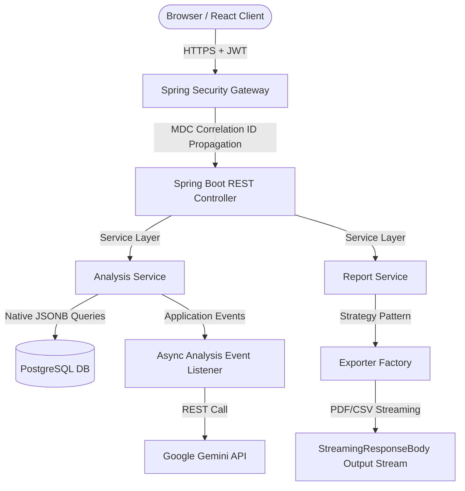

# OpinAI - SaaS Feedback Analytics Powered by Generative AI

<!-- Badges -->

OpinAI is a multi-tenant SaaS platform designed to process, categorize, and extract structured analytical summaries and actionable opportunities from customer feedback using generative Artificial Intelligence.

---

## Why I Built OpinAI

OpinAI was developed as a professional portfolio project to simulate a production-ready Software-as-a-Service (SaaS) application. Instead of focusing solely on basic CRUD operations, the project was engineered to demonstrate senior-level software practices, focusing heavily on:

*   **Secure Multi-Tenant Isolation**: Ensuring zero-trust data containment across different registered users.
*   **Asynchronous Resilience**: Handling expensive external API processing cleanly without exhausting server resources.
*   **Performance Optimization**: Writing optimized data layers leveraging database-level operations instead of heavy JVM parsing.
*   **Clean & Maintainable Code**: Organizing components with decoupled patterns (Strategy, Factory) and solid transactional boundary separation.

---

## Project Statistics

*   **Backend**: Java 21 + Spring Boot 3.3 (Web, Security, Data JPA, Actuator)
*   **Frontend**: React 18 + TypeScript + Zustand (State Management)
*   **Database**: PostgreSQL 16 + Flyway (Schema Migration)
*   **Test Coverage**: 104 Automated Tests (JUnit 5, Mockito, MockMvc)
*   **Security**: Stateless JWT Authentication & MDC Log Propagation
*   **Reporting**: OpenPDF (PDF Rendering) + UTF-8 BOM CSV exports
*   **Deployment**: Docker & Docker Compose configured

---

## Technical Stack & Components

### 🖥️ Frontend
*   **Core**: React 18, TypeScript, Zustand (lightweight and optimized state management).
*   **Styling**: Tailwind CSS (responsive layouts and transitions).
*   **Data Visualization**: Recharts (interactive trend charts and gauges).
*   **Build Tooling**: Vite, Axios (HTTP client with token interceptors).

### ⚙️ Backend
*   **Core**: Java 21, Spring Boot 3.3, Spring Security (Stateless JWT Authentication).
*   **Persistence**: Spring Data JPA, PostgreSQL 16 (Native JSONB queries, B-Tree Indexes).
*   **Database Migrations**: Flyway.
*   **Reporting**: OpenPDF (programmatic PDF generation).

### 🛠️ Infrastructure & DevOps
*   **Orchestration**: Docker, Docker Compose (local environment orchestration).
*   **CI/CD**: GitHub Actions (configured, pending first remote execution).
*   **AI Engine**: Google Gemini API.

---

## Key Features

*   **Customer feedback ingestion**: Supports individual and batch uploads of customer reviews.
*   **AI-powered sentiment analysis**: Classifies overall review sentiments as positive, negative, or neutral.
*   **Opportunity and issue extraction**: Structuring key problem areas and actionable improvements.
*   **Executive summaries**: Summarizing uploaded feedback datasets into concise corporate paragraphs.
*   **Interactive analytics dashboard**: Real-time Net Sentiment Score (NSS) calculations and trend timelines.
*   **PDF and CSV report generation**: Corporate PDF rendering and BOM-compliant CSV exports.

---

## Screenshots

### 📊 Analytical Dashboard

### 🔍 Sentiment Analysis Details

### 📄 Report Downloads & History

---

## System Architecture

---

## Architecture Decisions

*   **Monolithic Architecture**: Designed as a modular monolith. This maintains deployment simplicity and avoids network overhead between synchronous components while keeping features separated cleanly into packages.
*   **JWT Stateless Authentication**: Uses JSON Web Tokens for session-less authentication. The security context is hydrated dynamically on every request from the `Authorization` header.
*   **Multi-Tenant Isolation**: Enforces tenant-level data segregation at the query level by joining operations with the authenticated `User` context. Cross-tenant resource access attempts return `404 Not Found` to avoid resource enumeration.
*   **Event-Driven Analysis Processing**: Long-running AI processing calls are decoupled from the HTTP request thread. The controller publishes a Spring `ApplicationEvent`, which is captured by an asynchronous `EventListener` running on a dedicated thread pool.
*   **Strategy & Factory Patterns**: Export engines (PDF, CSV) are decoupled using the Strategy Pattern under a unified interface. Exporters are instantiated dynamically by a Factory based on the requested format, making the system easily extensible to new formats.

---

## Engineering Challenges Solved

### 1. Memory Optimization in File Streaming
*   **Problem**: Generating and sending PDF or CSV reports containing extensive feedback datasets could load entire datasets into JVM memory, leading to garbage collection pauses or OutOfMemory (OOM) exceptions under load.
*   **Solution**: `StreamingResponseBody` was used to stream generated files directly to the client, keeping memory usage independent from final file size.

### 2. Connection Pool Exhaustion under External API Latency
*   **Problem**: Communicating with external AI APIs (Gemini) can introduce high latencies (3-15 seconds). If done inside a database transaction, the database connection is held open, quickly starving the connection pool.
*   **Solution**: Modeled transactional boundaries in `AnalysisEventListener` using `TransactionTemplate`. The database state is updated to `PROCESSING` in a short transaction, the connection is released back to the pool, the blocking HTTP call is executed completely outside a transaction context, and results are written in a second, independent transaction.

### 3. Aggregated Analytics on JSONB Columns
*   **Problem**: Fetching and parsing complex, nested JSON objects (such as sentiment distribution and lists of key issues) in Java to perform dashboard calculations causes high CPU overhead.
*   **Solution**: Implemented native PostgreSQL queries utilizing JSONB operators (`->>`) and array expansion (`jsonb_array_elements_text`). This allows complex calculations, trends, and aggregations to run directly on the database engine. Query performance was validated using PostgreSQL EXPLAIN ANALYZE on representative local datasets, achieving sub-25ms execution times under cached conditions.

### 4. Client-Side Race Conditions in Async Polling
*   **Problem**: Rapidly switching projects or timeframes in the dashboard could trigger overlapping asynchronous API calls. If an older request resolves after a newer one, the UI displays outdated metrics.
*   **Solution**: Configured Zustand stores and React hooks to manage an `AbortController`. When a new fetch action is triggered, any outstanding HTTP request is immediately cancelled using the request's abort signal, ensuring UI state integrity.

---

## Known Limitations

*   AI analysis depends on Google Gemini availability and quota limits.
*   AI responses may vary depending on model output and prompt interpretation.
*   Rate limiting is not implemented yet.
*   Distributed tracing (OpenTelemetry / Zipkin) is not implemented.

---

## Future Improvements (Roadmap)

*   **Bucket4j Rate Limiting**: Implement API rate limiting on public and heavy endpoints.
*   **Prometheus + Grafana Metrics**: Set up Micrometer registry metrics for monitoring latencies and DB connections.
*   **OpenTelemetry Distributed Tracing**: Add telemetry tracking across threads and external calls.
*   **Frontend Dockerization**: Add a multi-stage Docker build for the React/Vite client.
*   **Kubernetes Deployment**: Draft Helm charts for orchestrating container scaling.

---

## CI/CD & Testing

*   **Test Suite**: 104 unit and integration tests (built with JUnit 5 and Mockito) verifying JWT security contracts, multi-tenant isolation, and database serialization.
*   **GitHub Actions CI**: Configured and pending first validation run upon push. Runs the Maven wrapper verification suite (`mvnw verify`) inside an automated container workflow with a PostgreSQL service dependency.

---

## Local Setup & Installation

See the Spanish translation guide [README.es.md](./README.es.md) for detailed configuration, local environment variables (`.env`), and running with Docker Compose.
